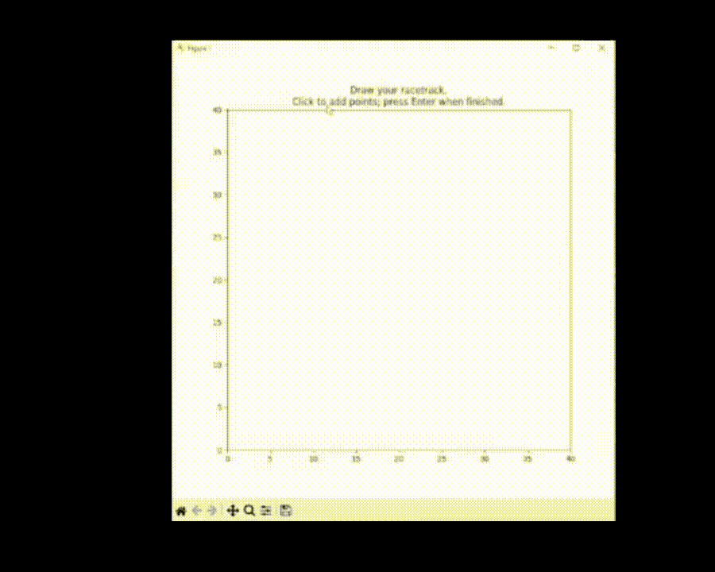

# MPC Controller with GUI for Racetrack

## Overview:

This repository contains a Python implementation of a Model Predictive Controller (MPC) that uses a graphical interface for users to draw a custom racetrack. The controller uses a 2D double integrator model to simulate a car following the user-defined track. The system predicts over a finite horizon using a receding-horizon strategy and visualizes the simulation through an animated Matplotlib plot.

## Features:

- **Interactive Track Drawing:**  
  Users can click on a Matplotlib window to draw a custom racetrack. When done, press Enter to submit the track.
  
- **Smooth Reference Generation:**  
  The drawn track is processed into a smooth reference trajectory using cubic spline interpolation (via SciPy).

- **Model Predictive Control (MPC):**  
  The MPC controller solves an optimization problem at each time step (using cvxpy) over a finite prediction horizon. It then applies only the first control action and repeats this process in a receding-horizon fashion.

- **Real-Time Animation:**  
  An animated visualization shows a "car" (represented as a rectangle) following the track.

## Prerequisites:

Ensure you have Python 3.x installed. The following Python packages are required:

- `numpy`
- `cvxpy`
- `matplotlib`
- `scipy`

You can install the dependencies using pip:

```bash
pip install numpy cvxpy matplotlib scipy
```

Sometimes cvxpy doesn't install properly when done all together, if it doesn't, then run install it seperately:

```bash
pip install cvxpy
```

## Running:

You can run the file with python in the terminal, clone the repository and make sure you are in the root directory. Then run:
```bash
python .\MPC.py
```

Then you will be prompted to draw out your track using points, and then the MPC will simulate a car going around this track. Default MPC-relevant values can be found in the THEORY.md file, and can be altered in the code to change the behavior of the car.



## References: 
- [This GitHub Repository](https://github.com/mcarfagno/mpc_python)

